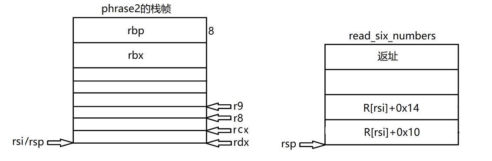
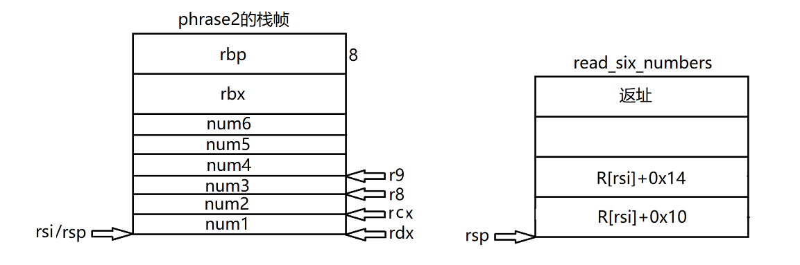
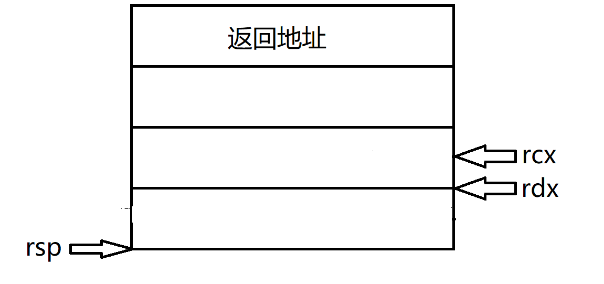
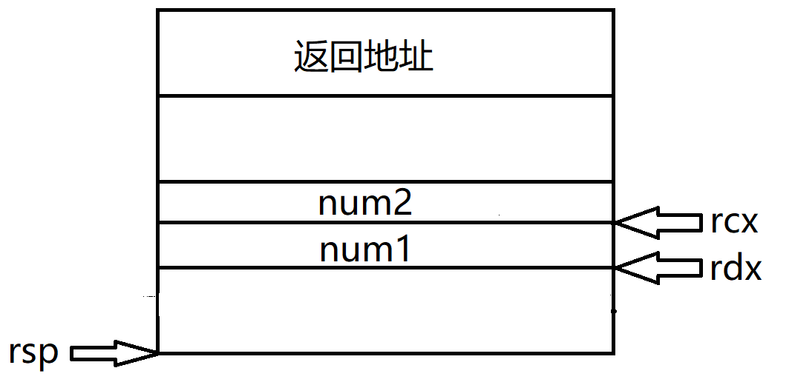
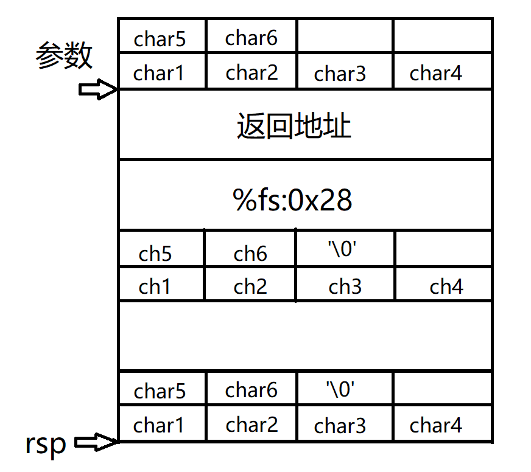
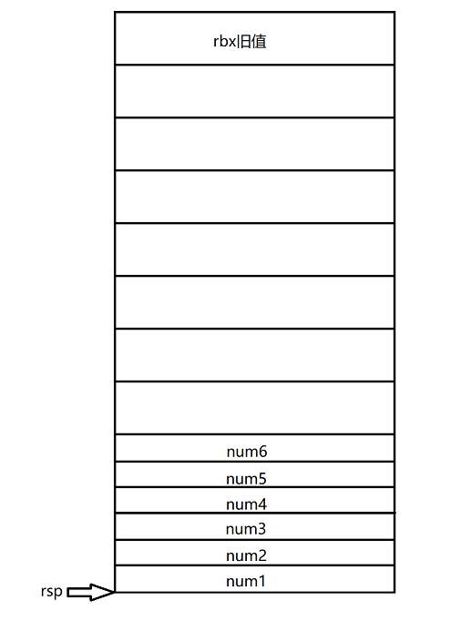
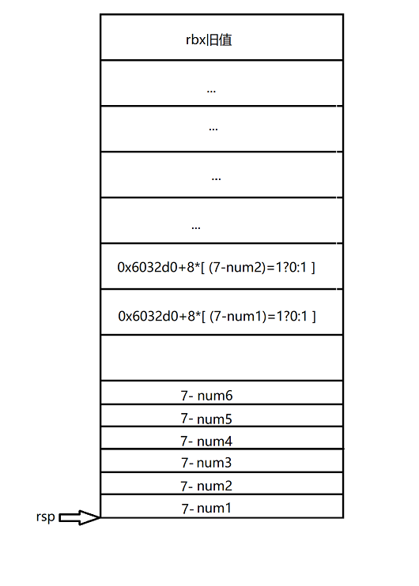
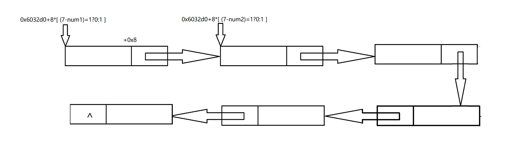
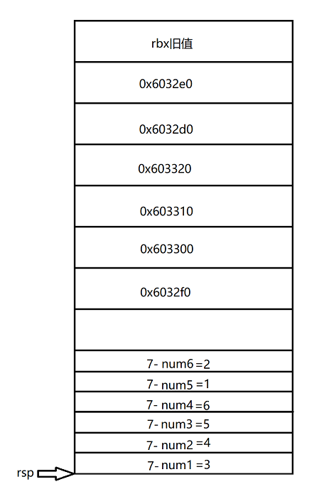
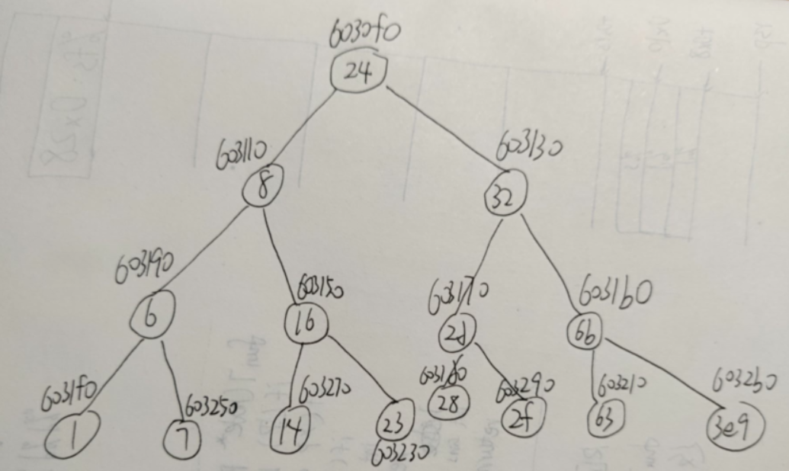

# Phase1

``` assembly
0000000000400ee0 <phase_1>:
  400ee0:	48 83 ec 08          	sub    $0x8,%rsp
  400ee4:	be 00 24 40 00       	mov    $0x402400,%esi
  400ee9:	e8 4a 04 00 00       	call   401338 <strings_not_equal>
  400eee:	85 c0                	test   %eax,%eax
  400ef0:	74 05                	je     400ef7 <phase_1+0x17>
  400ef2:	e8 43 05 00 00       	call   40143a <explode_bomb>
  400ef7:	48 83 c4 08          	add    $0x8,%rsp
  400efb:	c3                   	ret    
```

由上述代码可以看出, 是比较两个字符串是否相等.

在gdb中使用`x/s 0x402400`来查看首地址为`0x402400`的字符串.

``` shell
(gdb) x/s 0x402400
0x402400:	"Border relations with Canada have never been better."
```


# Phase2

``` assembly
0000000000400efc <phase_2>:
  400efc:	55                   	push   %rbp
  400efd:	53                   	push   %rbx
  400efe:	48 83 ec 28          	sub    $0x28,%rsp
  400f02:	48 89 e6             	mov    %rsp,%rsi
  400f05:	e8 52 05 00 00       	call   40145c <read_six_numbers>
  400f0a:	83 3c 24 01          	cmpl   $0x1,(%rsp)
  400f0e:	74 20                	je     400f30 <phase_2+0x34>
  400f10:	e8 25 05 00 00       	call   40143a <explode_bomb>
  400f15:	eb 19                	jmp    400f30 <phase_2+0x34>
  400f17:	8b 43 fc             	mov    -0x4(%rbx),%eax
  400f1a:	01 c0                	add    %eax,%eax
  400f1c:	39 03                	cmp    %eax,(%rbx)
  400f1e:	74 05                	je     400f25 <phase_2+0x29>
  400f20:	e8 15 05 00 00       	call   40143a <explode_bomb>
  400f25:	48 83 c3 04          	add    $0x4,%rbx
  400f29:	48 39 eb             	cmp    %rbp,%rbx
  400f2c:	75 e9                	jne    400f17 <phase_2+0x1b>
  400f2e:	eb 0c                	jmp    400f3c <phase_2+0x40>
  400f30:	48 8d 5c 24 04       	lea    0x4(%rsp),%rbx
  400f35:	48 8d 6c 24 18       	lea    0x18(%rsp),%rbp
  400f3a:	eb db                	jmp    400f17 <phase_2+0x1b>
  400f3c:	48 83 c4 28          	add    $0x28,%rsp
  400f40:	5b                   	pop    %rbx
  400f41:	5d                   	pop    %rbp
  400f42:	c3                   	ret    

000000000040145c <read_six_numbers>:
  40145c:	48 83 ec 18          	sub    $0x18,%rsp
  401460:	48 89 f2             	mov    %rsi,%rdx
  401463:	48 8d 4e 04          	lea    0x4(%rsi),%rcx
  401467:	48 8d 46 14          	lea    0x14(%rsi),%rax
  40146b:	48 89 44 24 08       	mov    %rax,0x8(%rsp)
  401470:	48 8d 46 10          	lea    0x10(%rsi),%rax
  401474:	48 89 04 24          	mov    %rax,(%rsp)
  401478:	4c 8d 4e 0c          	lea    0xc(%rsi),%r9
  40147c:	4c 8d 46 08          	lea    0x8(%rsi),%r8
  401480:	be c3 25 40 00       	mov    $0x4025c3,%esi
  401485:	b8 00 00 00 00       	mov    $0x0,%eax
  40148a:	e8 61 f7 ff ff       	call   400bf0 <__isoc99_sscanf@plt>
  40148f:	83 f8 05             	cmp    $0x5,%eax
  401492:	7f 05                	jg     401499 <read_six_numbers+0x3d>
  401494:	e8 a1 ff ff ff       	call   40143a <explode_bomb>
  401499:	48 83 c4 18          	add    $0x18,%rsp
  40149d:	c3                   	ret    
```

在函数`read_six_numbers`中调用了`__isoc99_sscanf@plt`, 这是一个库函数, 其函数签名如下

``` C++
int sscanf(const char *str, const char *format, ...)
```

参数传递给函数时, 使用寄存器的顺序为`%rdi, %rsi, %rdx, %rcx, %r8, %r9 `, 如果还有多余的参数, 则会使用栈帧.

第一个参数`str`用`rdi`来传递, 第二个参数`format`用`rsi`来传递.

``` assembly
  401480:	be c3 25 40 00       	mov    $0x4025c3,%esi	#gdb中观测到字符串为"%d %d %d %d %d %d"
```

剩下的六个参数, 四个用寄存器, 还有两个用栈来传递.

运行到`0x401485`时, 栈帧如下图所示



那么, 执行完`sscanf`后数据分布会如下图



接下来观察phase2函数

``` assembly
0000000000400efc <phase_2>:
  # ...
  400f0a:	83 3c 24 01          	cmpl   $0x1,(%rsp)	# 比较num1和M[R[rsp]],num1的值为1
  400f0e:	74 20                	je     400f30 <phase_2+0x34>
  400f10:	e8 25 05 00 00       	call   40143a <explode_bomb>
  400f15:	eb 19                	jmp    400f30 <phase_2+0x34>
  400f17:	8b 43 fc             	mov    -0x4(%rbx),%eax		# R[eax] = M[R[rbx] - 0x4]
  400f1a:	01 c0                	add    %eax,%eax			# R[eax] += R[eax]
  400f1c:	39 03                	cmp    %eax,(%rbx)			# 比较R[eax]和M[R[rbx]]
  400f1e:	74 05                	je     400f25 <phase_2+0x29>
  400f20:	e8 15 05 00 00       	call   40143a <explode_bomb>
  400f25:	48 83 c3 04          	add    $0x4,%rbx			# R[rbx] += 0x4
  400f29:	48 39 eb             	cmp    %rbp,%rbx			# 比较R[rbp]和R[rbx]
  400f2c:	75 e9                	jne    400f17 <phase_2+0x1b>
  400f2e:	eb 0c                	jmp    400f3c <phase_2+0x40>
  400f30:	48 8d 5c 24 04       	lea    0x4(%rsp),%rbx		# R[rbx] = R[rsp] + 0x4
  400f35:	48 8d 6c 24 18       	lea    0x18(%rsp),%rbp		# R[rbp] = R[rsp] + 0x18
  400f3a:	eb db                	jmp    400f17 <phase_2+0x1b>
  400f3c:	48 83 c4 28          	add    $0x28,%rsp
  400f40:	5b                   	pop    %rbx
  400f41:	5d                   	pop    %rbp
  400f42:	c3                   	ret  
```

由上述汇编代码可以知道, num1为1, 且`num(x) = 2num(x-1)`

所以phase2的答案为`1 2 4 8 16 32`


# Phase3

``` assembly
0000000000400f43 <phase_3>:
  400f43:	48 83 ec 18          	sub    $0x18,%rsp
  400f47:	48 8d 4c 24 0c       	lea    0xc(%rsp),%rcx
  400f4c:	48 8d 54 24 08       	lea    0x8(%rsp),%rdx
  400f51:	be cf 25 40 00       	mov    $0x4025cf,%esi
  400f56:	b8 00 00 00 00       	mov    $0x0,%eax
  400f5b:	e8 90 fc ff ff       	call   400bf0 <__isoc99_sscanf@plt>	# sscanf
  400f60:	83 f8 01             	cmp    $0x1,%eax
  400f63:	7f 05                	jg     400f6a <phase_3+0x27>
  400f65:	e8 d0 04 00 00       	call   40143a <explode_bomb>
  400f6a:	83 7c 24 08 07       	cmpl   $0x7,0x8(%rsp)			# 比较num1和0x7
  400f6f:	77 3c                	ja     400fad <phase_3+0x6a>	# num1大于7,则失败
  400f71:	8b 44 24 08          	mov    0x8(%rsp),%eax			# R[eax] = M[R[rsp] + 0x8]
  400f75:	ff 24 c5 70 24 40 00 	jmp    *0x402470(,%rax,8)		
  # 跳转地址为*(0x402470+8*R[rax])
  
  400f7c:	b8 cf 00 00 00       	mov    $0xcf,%eax
  400f81:	eb 3b                	jmp    400fbe <phase_3+0x7b>
  400f83:	b8 c3 02 00 00       	mov    $0x2c3,%eax
  400f88:	eb 34                	jmp    400fbe <phase_3+0x7b>
  400f8a:	b8 00 01 00 00       	mov    $0x100,%eax
  400f8f:	eb 2d                	jmp    400fbe <phase_3+0x7b>
  400f91:	b8 85 01 00 00       	mov    $0x185,%eax
  400f96:	eb 26                	jmp    400fbe <phase_3+0x7b>
  400f98:	b8 ce 00 00 00       	mov    $0xce,%eax
  400f9d:	eb 1f                	jmp    400fbe <phase_3+0x7b>
  400f9f:	b8 aa 02 00 00       	mov    $0x2aa,%eax
  400fa4:	eb 18                	jmp    400fbe <phase_3+0x7b>
  400fa6:	b8 47 01 00 00       	mov    $0x147,%eax
  400fab:	eb 11                	jmp    400fbe <phase_3+0x7b>
  400fad:	e8 88 04 00 00       	call   40143a <explode_bomb>
  400fb2:	b8 00 00 00 00       	mov    $0x0,%eax
  400fb7:	eb 05                	jmp    400fbe <phase_3+0x7b>
  400fb9:	b8 37 01 00 00       	mov    $0x137,%eax
  400fbe:	3b 44 24 0c          	cmp    0xc(%rsp),%eax
  400fc2:	74 05                	je     400fc9 <phase_3+0x86>
  400fc4:	e8 71 04 00 00       	call   40143a <explode_bomb>
  400fc9:	48 83 c4 18          	add    $0x18,%rsp
  400fcd:	c3                   	ret    
```


执行到`0x400f5b`之前, 栈帧如下.



 起始地址为`0x4025cf`的字符串如下

``` shell
(gdb) x/s 0x4025cf
0x4025cf:	"%d %d"
```


参数传递给函数时, 使用寄存器的顺序为`%rdi, %rsi, %rdx, %rcx, %r8, %r9 `, 如果还有多余的参数, 则会使用栈帧.

则执行完`sscanf`后, 栈帧如下




``` assembly
  400f75:	ff 24 c5 70 24 40 00 	jmp    *0x402470(,%rax,8)		
  # 跳转地址为*(0x402470+8*R[rax]),即地址为0x402470+8*R[rax]的值
```

查看`0x402470`处内存地址的值

``` shell
(gdb) x/16xw 0x402470
0x402470:	0x00400f7c	0x00000000	0x00400fb9	0x00000000
0x402480:	0x00400f83	0x00000000	0x00400f8a	0x00000000
0x402490:	0x00400f91	0x00000000	0x00400f98	0x00000000
0x4024a0:	0x00400f9f	0x00000000	0x00400fa6	0x00000000

num=0 跳转地址0x00400f7c
num=1 跳转地址0x00400fb9
num=2 跳转地址0x00400f83
num=3 跳转地址0x00400f8a
num=4 跳转地址0x00400f91
num=5 跳转地址0x00400f98
num=6 跳转地址0x00400f9f
num>=7 失败
```

在`phase3`函数的汇编代码中可以看到, 跳转的地址所对应的指令都是`mov xx, %eax`的形式, 即需要选一个地址给eax赋正确的值

然后跳转到`0x400fbe`, 将num2和eax比较, 相等的话成功

所以有好几个答案符合

``` 
0	207(0xcf)
1	311(0x137)
2	707(0x2c3)
3	256(0x100)
4	389(0x185)
5	206(0xce)
6	682(0x2aa)
```


# Phase4

``` assembly
000000000040100c <phase_4>:
  40100c:	48 83 ec 18          	sub    $0x18,%rsp
  401010:	48 8d 4c 24 0c       	lea    0xc(%rsp),%rcx
  401015:	48 8d 54 24 08       	lea    0x8(%rsp),%rdx
  40101a:	be cf 25 40 00       	mov    $0x4025cf,%esi
  40101f:	b8 00 00 00 00       	mov    $0x0,%eax
  401024:	e8 c7 fb ff ff       	call   400bf0 <__isoc99_sscanf@plt>
  401029:	83 f8 02             	cmp    $0x2,%eax
  40102c:	75 07                	jne    401035 <phase_4+0x29>
  40102e:	83 7c 24 08 0e       	cmpl   $0xe,0x8(%rsp)	# 比较num1和14
  401033:	76 05                	jbe    40103a <phase_4+0x2e>	# num1 <= 14时跳转,否则失败
  401035:	e8 00 04 00 00       	call   40143a <explode_bomb>
  40103a:	ba 0e 00 00 00       	mov    $0xe,%edx	# R[edx] = 14
  40103f:	be 00 00 00 00       	mov    $0x0,%esi	# R[esi] = 0
  401044:	8b 7c 24 08          	mov    0x8(%rsp),%edi # R[edi] = M[R[rsp] + 8] = num1
  401048:	e8 81 ff ff ff       	call   400fce <func4>
  40104d:	85 c0                	test   %eax,%eax	# func4的返回值需要为0
  40104f:	75 07                	jne    401058 <phase_4+0x4c>
  401051:	83 7c 24 0c 00       	cmpl   $0x0,0xc(%rsp)	# num2需要为0
  401056:	74 05                	je     40105d <phase_4+0x51>
  401058:	e8 dd 03 00 00       	call   40143a <explode_bomb>
  40105d:	48 83 c4 18          	add    $0x18,%rsp
  401061:	c3                   	ret    
  
0000000000400fce <func4>:
  400fce:	48 83 ec 08          	sub    $0x8,%rsp
  400fd2:	89 d0                	mov    %edx,%eax	# R[eax] = R[edx]
  400fd4:	29 f0                	sub    %esi,%eax	# R[eax] = R[eax] - R[esi]
  400fd6:	89 c1                	mov    %eax,%ecx	# R[ecx] = R[eax]
  400fd8:	c1 e9 1f             	shr    $0x1f,%ecx	# R[ecx] >>= 31
  400fdb:	01 c8                	add    %ecx,%eax	# R[eax] += R[ecx]
  400fdd:	d1 f8                	sar    %eax			
  400fdf:	8d 0c 30             	lea    (%rax,%rsi,1),%ecx	# R[ecx] = R[rax]+R[rsi]+1
  400fe2:	39 f9                	cmp    %edi,%ecx	# 比较R[ecx]和R[edi]
  400fe4:	7e 0c                	jle    400ff2 <func4+0x24>	# R[edi]小于R[ecx]时跳转
  400fe6:	8d 51 ff             	lea    -0x1(%rcx),%edx	# R[edx] = R[rcx] - 1
  400fe9:	e8 e0 ff ff ff       	call   400fce <func4>	# 递归调用
  400fee:	01 c0                	add    %eax,%eax		# R[eax] += R[eax]
  400ff0:	eb 15                	jmp    401007 <func4+0x39>	# 返回
  400ff2:	b8 00 00 00 00       	mov    $0x0,%eax	# R[eax] = 0
  400ff7:	39 f9                	cmp    %edi,%ecx	# 比较R[ecx]和R[edi]
  400ff9:	7d 0c                	jge    401007 <func4+0x39>	# R[edx] >= R[edi]的话返回
  400ffb:	8d 71 01             	lea    0x1(%rcx),%esi	# R[esi] = R[rcx] + 1
  400ffe:	e8 cb ff ff ff       	call   400fce <func4>	# 递归调用
  401003:	8d 44 00 01          	lea    0x1(%rax,%rax,1),%eax	# R[eax] = 2 * R[rax] + 1
  401007:	48 83 c4 08          	add    $0x8,%rsp
  40100b:	c3                   	ret  
```

`phase4`从开始到`0x401024`这部分与`phase3`一样, 所以执行完`sscanf`的栈帧如下


参数传递给函数时, 使用寄存器的顺序为`%rdi, %rsi, %rdx, %rcx, %r8, %r9 `, 如果还有多余的参数, 则会使用栈帧.

在执行到`0x401048`, 即调用func4之前, 设置了三个参数的值为`(num1, 0, 14)`

func4是一个递归函数, 可以改写为如下的C代码

``` C
int func4(int x, int y, int z) {	// x(rdi), y(rsi), z(rdx)
	int ret = z - y;
   	ret += (ret >> 31);
    ret >>= 1;
    int tmp = ret + y;
    if (tmp <= x) {
        ret = 0;
        if (tmp >= x) {
            return ret;
        } else {
            y = tmp + 1;
            return 2 * func4(x, y, z) + 1;
        }
    } else {
        z = tmp - 1;
        return 2 * func4(x, y, z);
    }
}
```

由于func4需要返回0, 参数y, z已经确定, x的范围为[0, 14]. 执行可得 `x=0/1/3/7`时func4返回0.

由于num2需要为0, 所以答案如下

``` 
0 0
1 0
3 0
7 0
```


# Phase5

``` assembly

0000000000401062 <phase_5>:
  401062:	53                   	push   %rbx
  401063:	48 83 ec 20          	sub    $0x20,%rsp
  401067:	48 89 fb             	mov    %rdi,%rbx
  40106a:	64 48 8b 04 25 28 00 	mov    %fs:0x28,%rax
  401071:	00 00 
  401073:	48 89 44 24 18       	mov    %rax,0x18(%rsp)
  401078:	31 c0                	xor    %eax,%eax
  40107a:	e8 9c 02 00 00       	call   40131b <string_length>
  40107f:	83 f8 06             	cmp    $0x6,%eax	# 输入的字符串的长度需要为6
  401082:	74 4e                	je     4010d2 <phase_5+0x70>
  401084:	e8 b1 03 00 00       	call   40143a <explode_bomb>
  401089:	eb 47                	jmp    4010d2 <phase_5+0x70>
  40108b:	0f b6 0c 03          	movzbl (%rbx,%rax,1),%ecx	# R[ecx] = M[R[rbx]+R[rax]]
  # 将内存地址为R[rbx]+R[rax]的一个字节零扩展为32bit,赋值给ecx
  
  40108f:	88 0c 24             	mov    %cl,(%rsp)	# M[R[rsp]] = R[cl]	8bit
  401092:	48 8b 14 24          	mov    (%rsp),%rdx	# R[rdx] = M[R[rsp]]
  401096:	83 e2 0f             	and    $0xf,%edx	# R[edx] &= 0xf
  401099:	0f b6 92 b0 24 40 00 	movzbl 0x4024b0(%rdx),%edx	# R[edx]=M[R[rdx]+0x4024b0]
  4010a0:	88 54 04 10          	mov    %dl,0x10(%rsp,%rax,1) # M[R[rsp]+R[rax]+0x10]=R[dl]
  4010a4:	48 83 c0 01          	add    $0x1,%rax
  4010a8:	48 83 f8 06          	cmp    $0x6,%rax	# 循环6次
  4010ac:	75 dd                	jne    40108b <phase_5+0x29>
  4010ae:	c6 44 24 16 00       	movb   $0x0,0x16(%rsp)
  4010b3:	be 5e 24 40 00       	mov    $0x40245e,%esi
  4010b8:	48 8d 7c 24 10       	lea    0x10(%rsp),%rdi	# 两个参数rdi,esi
  4010bd:	e8 76 02 00 00       	call   401338 <strings_not_equal>
  4010c2:	85 c0                	test   %eax,%eax
  4010c4:	74 13                	je     4010d9 <phase_5+0x77>
  4010c6:	e8 6f 03 00 00       	call   40143a <explode_bomb>
  4010cb:	0f 1f 44 00 00       	nopl   0x0(%rax,%rax,1)
  4010d0:	eb 07                	jmp    4010d9 <phase_5+0x77>
  4010d2:	b8 00 00 00 00       	mov    $0x0,%eax	# R[eax] = 0
  4010d7:	eb b2                	jmp    40108b <phase_5+0x29>
  4010d9:	48 8b 44 24 18       	mov    0x18(%rsp),%rax	# 比较哨兵,防止栈破坏
  4010de:	64 48 33 04 25 28 00 	xor    %fs:0x28,%rax
  4010e5:	00 00 
  4010e7:	74 05                	je     4010ee <phase_5+0x8c>
  4010e9:	e8 42 fa ff ff       	call   400b30 <__stack_chk_fail@plt>
  4010ee:	48 83 c4 20          	add    $0x20,%rsp
  4010f2:	5b                   	pop    %rbx
  4010f3:	c3                   	ret    

0000000000401338 <strings_not_equal>:	# 两个字符串相等时返回0,否则返回1
  401338:	41 54                	push   %r12
  40133a:	55                   	push   %rbp
  40133b:	53                   	push   %rbx
  40133c:	48 89 fb             	mov    %rdi,%rbx
  40133f:	48 89 f5             	mov    %rsi,%rbp	# 使用到了rdi和rsi,有两个参数.
  # 考虑到函数名,rdi和rsi为两个字符串的首地址
  401342:	e8 d4 ff ff ff       	call   40131b <string_length>
  401347:	41 89 c4             	mov    %eax,%r12d
  40134a:	48 89 ef             	mov    %rbp,%rdi
  40134d:	e8 c9 ff ff ff       	call   40131b <string_length>
  401352:	ba 01 00 00 00       	mov    $0x1,%edx
  401357:	41 39 c4             	cmp    %eax,%r12d
  40135a:	75 3f                	jne    40139b <strings_not_equal+0x63>
  40135c:	0f b6 03             	movzbl (%rbx),%eax
  40135f:	84 c0                	test   %al,%al
  401361:	74 25                	je     401388 <strings_not_equal+0x50>
  401363:	3a 45 00             	cmp    0x0(%rbp),%al
  401366:	74 0a                	je     401372 <strings_not_equal+0x3a>
  401368:	eb 25                	jmp    40138f <strings_not_equal+0x57>
  40136a:	3a 45 00             	cmp    0x0(%rbp),%al
  40136d:	0f 1f 00             	nopl   (%rax)
  401370:	75 24                	jne    401396 <strings_not_equal+0x5e>
  401372:	48 83 c3 01          	add    $0x1,%rbx
  401376:	48 83 c5 01          	add    $0x1,%rbp
  40137a:	0f b6 03             	movzbl (%rbx),%eax
  40137d:	84 c0                	test   %al,%al
  40137f:	75 e9                	jne    40136a <strings_not_equal+0x32>
  401381:	ba 00 00 00 00       	mov    $0x0,%edx
  401386:	eb 13                	jmp    40139b <strings_not_equal+0x63>
  401388:	ba 00 00 00 00       	mov    $0x0,%edx
  40138d:	eb 0c                	jmp    40139b <strings_not_equal+0x63>
  40138f:	ba 01 00 00 00       	mov    $0x1,%edx
  401394:	eb 05                	jmp    40139b <strings_not_equal+0x63>
  401396:	ba 01 00 00 00       	mov    $0x1,%edx
  40139b:	89 d0                	mov    %edx,%eax
  40139d:	5b                   	pop    %rbx
  40139e:	5d                   	pop    %rbp
  40139f:	41 5c                	pop    %r12
  4013a1:	c3                   	ret    
```

执行到`0x4010ae`的栈帧如下


$$
chx=M[charx \& 0xf + 0x4024b0]
$$
以`R[rsp]+10`为首地址的字符串需要和以`0x40245e`为首地址的字符串相等

``` shell
(gdb) x/s 0x40245e
0x40245e:	"flyers"

(gdb) x/16c 0x4024b0
0x4024b0 	109 'm'	97 'a'	100 'd'	117 'u'	105 'i'	101 'e'	114 'r'	115 's'
0x4024b8 	110 'n'	102 'f'	111 'o'	116 't'	118 'v'	98 'b'	121 'y'	108 'l'

```

综上所述, 输入字符串的每个字符和0xf的与为取得字符的偏移量.

由于ch1~ch6要和"flyers"相等, 所以ch1='f', ch2='l' ...

`chx=M[charx & 0xf + 0x4024b0]`, 在上述`x/16c`命令可以看出,'f'的偏移量为9.所以char1~char6的结构如下

``` 
char1 = 0x()9
char2 = 0x()f
char3 = 0x()e
char4 = 0x()5
char5 = 0x()6
char6 = 0x()7

由于char1~char6为ASCII字符,在表中查询即可

一组可能的解: "IONEFG"
```

 

# Phase6

``` assembly
00000000004010f4 <phase_6>:
  4010f4:	41 56                	push   %r14
  4010f6:	41 55                	push   %r13
  4010f8:	41 54                	push   %r12
  4010fa:	55                   	push   %rbp
  4010fb:	53                   	push   %rbx
  4010fc:	48 83 ec 50          	sub    $0x50,%rsp
  401100:	49 89 e5             	mov    %rsp,%r13
  401103:	48 89 e6             	mov    %rsp,%rsi
  401106:	e8 51 03 00 00       	call   40145c <read_six_numbers>
  40110b:	49 89 e6             	mov    %rsp,%r14
  40110e:	41 bc 00 00 00 00    	mov    $0x0,%r12d
  401114:	4c 89 ed             	mov    %r13,%rbp
  401117:	41 8b 45 00          	mov    0x0(%r13),%eax	# R[eax]=M[R[r13]+0]
  40111b:	83 e8 01             	sub    $0x1,%eax
  40111e:	83 f8 05             	cmp    $0x5,%eax		
  # num1-1要小于等于5,不然失败,所以num1小于等于6
  401121:	76 05                	jbe    401128 <phase_6+0x34>
  401123:	e8 12 03 00 00       	call   40143a <explode_bomb>
  401128:	41 83 c4 01          	add    $0x1,%r12d		# R[r12d]+=1
  40112c:	41 83 fc 06          	cmp    $0x6,%r12d		# 六次循环后跳转到0x401153 
  401130:	74 21                	je     401153 <phase_6+0x5f>
  401132:	44 89 e3             	mov    %r12d,%ebx
  401135:	48 63 c3             	movslq %ebx,%rax
  401138:	8b 04 84             	mov    (%rsp,%rax,4),%eax	# R[eax]=M[  R[rsp]+4*R[rax] ]
  40113b:	39 45 00             	cmp    %eax,0x0(%rbp)	# num2~num6都不可以与num1相等
  40113e:	75 05                	jne    401145 <phase_6+0x51>
  401140:	e8 f5 02 00 00       	call   40143a <explode_bomb>
  401145:	83 c3 01             	add    $0x1,%ebx
  401148:	83 fb 05             	cmp    $0x5,%ebx
  40114b:	7e e8                	jle    401135 <phase_6+0x41>
  40114d:	49 83 c5 04          	add    $0x4,%r13
  401151:	eb c1                	jmp    401114 <phase_6+0x20> # 循环
  # 0x401121~0x401151这段代码实现的作用是确保num1~num6都不大于7,且每一个数字都不相同

  # 想执行下列命令,只有0x401130可以实现
  401153:	48 8d 74 24 18       	lea    0x18(%rsp),%rsi
  401158:	4c 89 f0             	mov    %r14,%rax
  40115b:	b9 07 00 00 00       	mov    $0x7,%ecx
  401160:	89 ca                	mov    %ecx,%edx
  401162:	2b 10                	sub    (%rax),%edx
  401164:	89 10                	mov    %edx,(%rax)
  401166:	48 83 c0 04          	add    $0x4,%rax
  40116a:	48 39 f0             	cmp    %rsi,%rax
  40116d:	75 f1                	jne    401160 <phase_6+0x6c>
  # 上面的代码将num1~num6修改为(7-num1)~(7-num6)
  
  40116f:	be 00 00 00 00       	mov    $0x0,%esi
  401174:	eb 21                	jmp    401197 <phase_6+0xa3>
  401176:	48 8b 52 08          	mov    0x8(%rdx),%rdx
  40117a:	83 c0 01             	add    $0x1,%eax
  40117d:	39 c8                	cmp    %ecx,%eax
  40117f:	75 f5                	jne    401176 <phase_6+0x82>
  401181:	eb 05                	jmp    401188 <phase_6+0x94>
  401183:	ba d0 32 60 00       	mov    $0x6032d0,%edx
  401188:	48 89 54 74 20       	mov    %rdx,0x20(%rsp,%rsi,2)
  40118d:	48 83 c6 04          	add    $0x4,%rsi
  401191:	48 83 fe 18          	cmp    $0x18,%rsi
  401195:	74 14                	je     4011ab <phase_6+0xb7>
  401197:	8b 0c 34             	mov    (%rsp,%rsi,1),%ecx	# R[ecx]=M[ R[rsp]+R[rsi] ]
  40119a:	83 f9 01             	cmp    $0x1,%ecx			# 比R[ecx]和1
  40119d:	7e e4                	jle    401183 <phase_6+0x8f># 由于num的限制,只会跳转一次
  40119f:	b8 01 00 00 00       	mov    $0x1,%eax
  4011a4:	ba d0 32 60 00       	mov    $0x6032d0,%edx
  4011a9:	eb cb                	jmp    401176 <phase_6+0x82>
  # 上述代码将0x6032d0开始的六个node的首地址赋值给M[ R[rsp] + 0x20 ] ~ M [ R[rsp] + 0x48 ] 
  
  # 只能由0x401195到达
  4011ab:	48 8b 5c 24 20       	mov    0x20(%rsp),%rbx	# R[rbx]=addr1
  4011b0:	48 8d 44 24 28       	lea    0x28(%rsp),%rax	# R[rax]=R[rsp]+0x28
  4011b5:	48 8d 74 24 50       	lea    0x50(%rsp),%rsi	# boundary
  4011ba:	48 89 d9             	mov    %rbx,%rcx
  4011bd:	48 8b 10             	mov    (%rax),%rdx		# R[rdx]=addr2
  4011c0:	48 89 51 08          	mov    %rdx,0x8(%rcx)
  4011c4:	48 83 c0 08          	add    $0x8,%rax
  4011c8:	48 39 f0             	cmp    %rsi,%rax
  4011cb:	74 05                	je     4011d2 <phase_6+0xde>
  4011cd:	48 89 d1             	mov    %rdx,%rcx
  4011d0:	eb eb                	jmp    4011bd <phase_6+0xc9>
  4011d2:	48 c7 42 08 00 00 00 	movq   $0x0,0x8(%rdx)
  4011d9:	00 
  # 上面代码的作用是构建一个链表
  
  4011da:	bd 05 00 00 00       	mov    $0x5,%ebp
  4011df:	48 8b 43 08          	mov    0x8(%rbx),%rax	# R[rbx]初值为R[rsp]+0x20
  4011e3:	8b 00                	mov    (%rax),%eax
  4011e5:	39 03                	cmp    %eax,(%rbx)		# 比较32bit的大小
  4011e7:	7d 05                	jge    4011ee <phase_6+0xfa>
  4011e9:	e8 4c 02 00 00       	call   40143a <explode_bomb>
  4011ee:	48 8b 5b 08          	mov    0x8(%rbx),%rbx
  4011f2:	83 ed 01             	sub    $0x1,%ebp
  4011f5:	75 e8                	jne    4011df <phase_6+0xeb>
  
  
  4011f7:	48 83 c4 50          	add    $0x50,%rsp
  4011fb:	5b                   	pop    %rbx
  4011fc:	5d                   	pop    %rbp
  4011fd:	41 5c                	pop    %r12
  4011ff:	41 5d                	pop    %r13
  401201:	41 5e                	pop    %r14
  401203:	c3                   	ret    

```

执行完`0x401106`栈帧如下



`0x401121~0x401151`改写为C语言如下

``` C
for (int i = 0; i < 6; i++) {
    int tmp = nums[i];
    if (tmp > 5) {
        explode_bomb();
    }
    for (int j = i + 1; j < 6; j++) {
        if (nums[i] == nums[j]) {
            explode_bomb();
        }
    }
}

// ...
```
`0x6032d0`处的内存内容如下

``` shell
(gdb) x/24x 0x6032d0
0x6032d0 <node1>:	0x0000014c	0x00000001	0x006032e0	0x00000000
0x6032e0 <node2>:	0x000000a8	0x00000002	0x006032f0	0x00000000
0x6032f0 <node3>:	0x0000039c	0x00000003	0x00603300	0x00000000
0x603300 <node4>:	0x000002b3	0x00000004	0x00603310	0x00000000
0x603310 <node5>:	0x000001dd	0x00000005	0x00603320	0x00000000
0x603320 <node6>:	0x000001bb	0x00000006	0x00000000	0x00000000

```


执行到`0x4011ab`栈帧如下



`0x4011ab~0x4011d9`的作用如下, 使`0x6032d0`处的六个node连接成一个链表




`0x4011da`到最后, 确保这个链表是倒序排列的. 比较的值是下述的开头32位

``` (gdb) x/24x 0x6032d0
0x6032d0 <node1>:	0x0000014c ... ... ...	第五个结点
0x6032e0 <node2>:	0x000000a8 ... ... ...	第六个结点
0x6032f0 <node3>:	0x0000039c ... ... ...	第一个结点
0x603300 <node4>:	0x000002b3 ... ... ...	第二个结点
0x603310 <node5>:	0x000001dd ... ... ...	第三个结点
0x603320 <node6>:	0x000001bb ... ... ...	第四个节点
```

则现在可以知道栈帧的具体值



则可以知道num1~num6的值是多少 


# Secret Phase

经过观察, 有一个函数`secret_phase`. 其会在`phase_defused`中被调用

``` assembly
00000000004015c4 <phase_defused>:
  4015c4:	48 83 ec 78          	sub    $0x78,%rsp
  4015c8:	64 48 8b 04 25 28 00 	mov    %fs:0x28,%rax
  4015cf:	00 00 
  4015d1:	48 89 44 24 68       	mov    %rax,0x68(%rsp)
  4015d6:	31 c0                	xor    %eax,%eax
  4015d8:	83 3d 81 21 20 00 06 	cmpl   $0x6,0x202181(%rip)        # 603760 <num_input_strings>
  # 经过观察内存地址0x603760的值,每次解决一个phase值加一

  4015df:	75 5e                	jne    40163f <phase_defused+0x7b>
  4015e1:	4c 8d 44 24 10       	lea    0x10(%rsp),%r8
  4015e6:	48 8d 4c 24 0c       	lea    0xc(%rsp),%rcx
  4015eb:	48 8d 54 24 08       	lea    0x8(%rsp),%rdx
  4015f0:	be 19 26 40 00       	mov    $0x402619,%esi	# 对应字符串为"%d %d %s"
  4015f5:	bf 70 38 60 00       	mov    $0x603870,%edi	# 经观察0x603870存放的是phase4的答案
  4015fa:	e8 f1 f5 ff ff       	call   400bf0 <__isoc99_sscanf@plt>
  4015ff:	83 f8 03             	cmp    $0x3,%eax
  401602:	75 31                	jne    401635 <phase_defused+0x71>
  401604:	be 22 26 40 00       	mov    $0x402622,%esi	
  # 对应字符串为"DrEvil",所以phase4答案后加一个DrEvil后,phase6结束后就能进入到secret phase
  
  401609:	48 8d 7c 24 10       	lea    0x10(%rsp),%rdi
  40160e:	e8 25 fd ff ff       	call   401338 <strings_not_equal>
  401613:	85 c0                	test   %eax,%eax
  401615:	75 1e                	jne    401635 <phase_defused+0x71>
  401617:	bf f8 24 40 00       	mov    $0x4024f8,%edi
  40161c:	e8 ef f4 ff ff       	call   400b10 <puts@plt>
  401621:	bf 20 25 40 00       	mov    $0x402520,%edi
  401626:	e8 e5 f4 ff ff       	call   400b10 <puts@plt>
  40162b:	b8 00 00 00 00       	mov    $0x0,%eax
  401630:	e8 0d fc ff ff       	call   401242 <secret_phase>	
  401635:	bf 58 25 40 00       	mov    $0x402558,%edi
  40163a:	e8 d1 f4 ff ff       	call   400b10 <puts@plt>
  40163f:	48 8b 44 24 68       	mov    0x68(%rsp),%rax
  401644:	64 48 33 04 25 28 00 	xor    %fs:0x28,%rax
  40164b:	00 00 
  40164d:	74 05                	je     401654 <phase_defused+0x90>
  40164f:	e8 dc f4 ff ff       	call   400b30 <__stack_chk_fail@plt>
  401654:	48 83 c4 78          	add    $0x78,%rsp
  401658:	c3                   	ret    
```


``` assembly

0000000000401204 <fun7>:
  401204:	48 83 ec 08          	sub    $0x8,%rsp
  401208:	48 85 ff             	test   %rdi,%rdi
  40120b:	74 2b                	je     401238 <fun7+0x34>
  40120d:	8b 17                	mov    (%rdi),%edx
  40120f:	39 f2                	cmp    %esi,%edx
  401211:	7e 0d                	jle    401220 <fun7+0x1c>
  401213:	48 8b 7f 08          	mov    0x8(%rdi),%rdi
  401217:	e8 e8 ff ff ff       	call   401204 <fun7>
  40121c:	01 c0                	add    %eax,%eax
  40121e:	eb 1d                	jmp    40123d <fun7+0x39>
  401220:	b8 00 00 00 00       	mov    $0x0,%eax
  401225:	39 f2                	cmp    %esi,%edx
  401227:	74 14                	je     40123d <fun7+0x39>
  401229:	48 8b 7f 10          	mov    0x10(%rdi),%rdi
  40122d:	e8 d2 ff ff ff       	call   401204 <fun7>
  401232:	8d 44 00 01          	lea    0x1(%rax,%rax,1),%eax
  401236:	eb 05                	jmp    40123d <fun7+0x39>
  401238:	b8 ff ff ff ff       	mov    $0xffffffff,%eax
  40123d:	48 83 c4 08          	add    $0x8,%rsp
  401241:	c3                   	ret    

0000000000401242 <secret_phase>:
  401242:	53                   	push   %rbx
  401243:	e8 56 02 00 00       	call   40149e <read_line>
  401248:	ba 0a 00 00 00       	mov    $0xa,%edx
  40124d:	be 00 00 00 00       	mov    $0x0,%esi
  401252:	48 89 c7             	mov    %rax,%rdi
  401255:	e8 76 f9 ff ff       	call   400bd0 <strtol@plt>
  40125a:	48 89 c3             	mov    %rax,%rbx
  40125d:	8d 40 ff             	lea    -0x1(%rax),%eax
  401260:	3d e8 03 00 00       	cmp    $0x3e8,%eax		#  输入的数字要小于0x3e8+1=0x3e9
  401265:	76 05                	jbe    40126c <secret_phase+0x2a>
  401267:	e8 ce 01 00 00       	call   40143a <explode_bomb>
  40126c:	89 de                	mov    %ebx,%esi		# R[esi]=R[ebx]=0x3e9
  40126e:	bf f0 30 60 00       	mov    $0x6030f0,%edi	# R[edi]=0x6030f0
  401273:	e8 8c ff ff ff       	call   401204 <fun7>
  401278:	83 f8 02             	cmp    $0x2,%eax		# fun7的返回值需要为0x2
  40127b:	74 05                	je     401282 <secret_phase+0x40>
  40127d:	e8 b8 01 00 00       	call   40143a <explode_bomb>
  401282:	bf 38 24 40 00       	mov    $0x402438,%edi
  401287:	e8 84 f8 ff ff       	call   400b10 <puts@plt>
  40128c:	e8 33 03 00 00       	call   4015c4 <phase_defused>
  401291:	5b                   	pop    %rbx
  401292:	c3                   	ret    
```

观察内存地址为0x6030f0处的值

``` shell
(gdb) x/128x 0x6030f0
0x6030f0 <n1>:		0x00000024	0x00000000	0x00603110	0x00000000
0x603100 <n1+16>:	0x00603130	0x00000000	0x00000000	0x00000000
0x603110 <n21>:		0x00000008	0x00000000	0x00603190	0x00000000
0x603120 <n21+16>:	0x00603150	0x00000000	0x00000000	0x00000000
0x603130 <n22>:		0x00000032	0x00000000	0x00603170	0x00000000
0x603140 <n22+16>:	0x006031b0	0x00000000	0x00000000	0x00000000
0x603150 <n32>:		0x00000016	0x00000000	0x00603270	0x00000000
0x603160 <n32+16>:	0x00603230	0x00000000	0x00000000	0x00000000
0x603170 <n33>:		0x0000002d	0x00000000	0x006031d0	0x00000000
0x603180 <n33+16>:	0x00603290	0x00000000	0x00000000	0x00000000
0x603190 <n31>:		0x00000006	0x00000000	0x006031f0	0x00000000
0x6031a0 <n31+16>:	0x00603250	0x00000000	0x00000000	0x00000000
0x6031b0 <n34>:		0x0000006b	0x00000000	0x00603210	0x00000000
0x6031c0 <n34+16>:	0x006032b0	0x00000000	0x00000000	0x00000000
0x6031d0 <n45>:		0x00000028	0x00000000	0x00000000	0x00000000
0x6031e0 <n45+16>:	0x00000000	0x00000000	0x00000000	0x00000000
0x6031f0 <n41>:		0x00000001	0x00000000	0x00000000	0x00000000
0x603200 <n41+16>:	0x00000000	0x00000000	0x00000000	0x00000000
0x603210 <n47>:		0x00000063	0x00000000	0x00000000	0x00000000
0x603220 <n47+16>:	0x00000000	0x00000000	0x00000000	0x00000000
0x603230 <n44>:		0x00000023	0x00000000	0x00000000	0x00000000
0x603240 <n44+16>:	0x00000000	0x00000000	0x00000000	0x00000000
0x603250 <n42>:		0x00000007	0x00000000	0x00000000	0x00000000
0x603260 <n42+16>:	0x00000000	0x00000000	0x00000000	0x00000000
0x603270 <n43>:		0x00000014	0x00000000	0x00000000	0x00000000
0x603280 <n43+16>:	0x00000000	0x00000000	0x00000000	0x00000000
0x603290 <n46>:		0x0000002f	0x00000000	0x00000000	0x00000000
0x6032a0 <n46+16>:	0x00000000	0x00000000	0x00000000	0x00000000
0x6032b0 <n48>:		0x000003e9	0x00000000	0x00000000	0x00000000
0x6032c0 <n48+16>:	0x00000000	0x00000000	0x00000000	0x00000000
```

可以看出, 这是一棵二叉树

`fun7`是对二叉树进行递归处理的函数, C语言形式如下

``` C
int traverse(TreeNode* p, int num) {
    if (!p) {
        return -1;
    }
    int tmp = p->val;
    int ret;
    if (tmp <= num) {
        ret = 0;
        if (tmp == num) {
            return ret;
        }
        return traverse(p->right, num) * 2 + 1;
    } else {
        return traverse(p->left, num) * 2;
    }
}
```

二叉树如下图.



由于fun7的返回值需要为2. 所以输入的值需要为`0x14`或`0x16`
