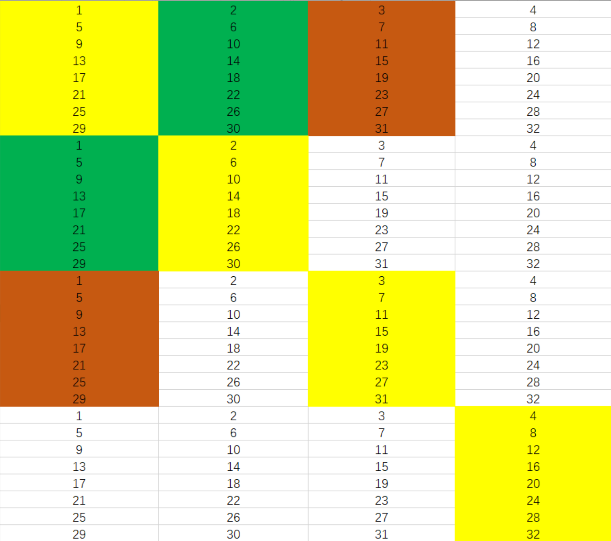
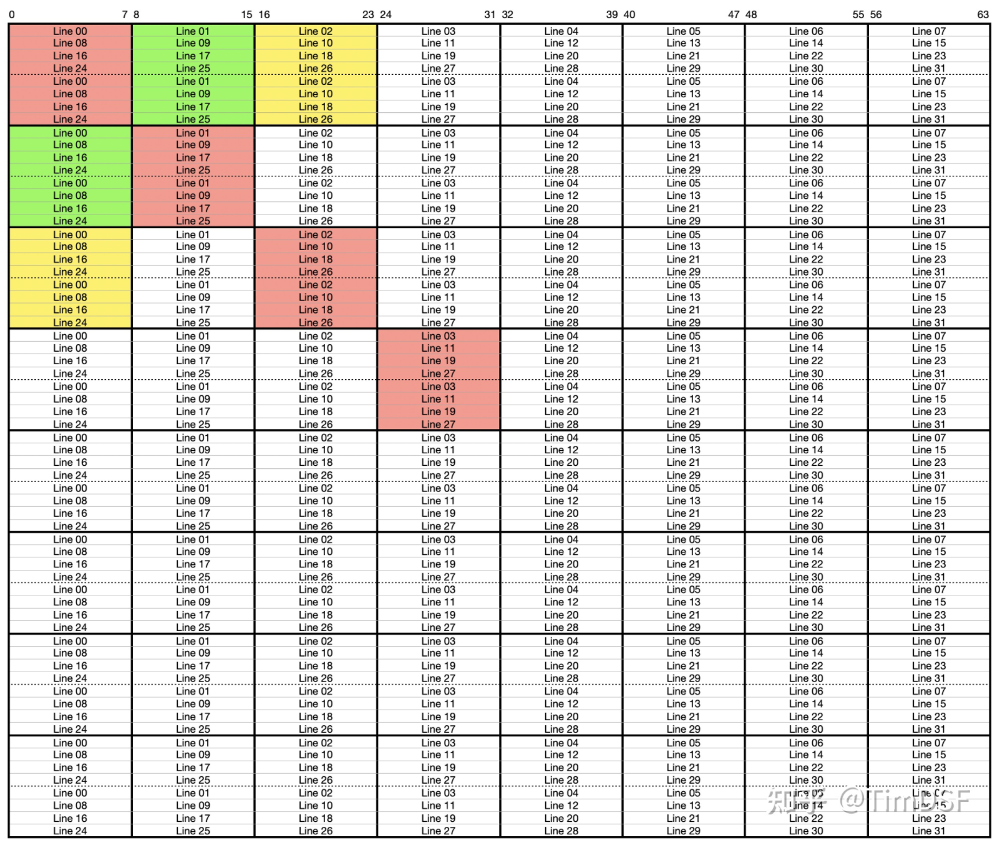
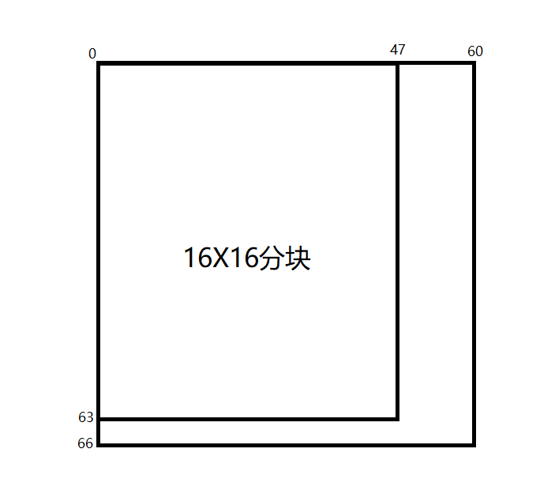

# Part A

用到的数据结构如下

``` C++
struct config {
    int verbose;
    int s;      int set_num;       // 2^s is the number of sets
    int E;      int line_num;      // a set has E lines
    int b;      int block_size;    // a line's data block has 2^b bytes
    int traces; char path[256];
} global_config;
	
struct record {		// 记录下hit, miss, eviction数
    int hits;		
    int misses;
    int evitions;
} global_record;

struct Line {	// set中的一行
    int valid;
    int time_tag;
    unsigned int start_addr;
};

struct Set {	// 一个set包含多个(或一个)line
    struct Line* lines;
};

struct Cache {	// cache中有多个set
    struct Set* sets;
} cache;
// 一个cache中有2^s个set,一个set有E行

int isInit = 0;		// 记录下cache是否初始化
int time_step = 0;	// 时间戳,用于给line赋值
```

L(load)操作, S(store)操作都是对内存的一次读取, M(modify)操作是一次L加一次S

内存访问的流程(假设访问内存地址为X的数据)

1. 根据X, 得到其对应的set的坐标
2. 在set包含的line中寻找
   - 如果有line的的数据区包含了X, 则hit
   - 如果没有hit
     - 如果此set已满, 需要eviction
     - 否则找到一个有效值为0的line, 插入即可

代码在`csim.c`和`csim_header.h`中


~~注: 执行评价程序`./test-csim`的时候有时候会扣分, 目前还没找到是什么原因~~


# Part B

part B为在(s = 5, E = 1, b = 5)条件下实现32×32, 64×64, 61×67矩阵的转置, 要求miss次数越少越好

A与B对应的块都映射到cache中的同一块中, 因此要注意冲突

## 32X32

一行有32个int, 即4个block, 32×32对应cache映射图如下



数字n为此块映射到cache中第n个set

由上图可知, 32×32可以分块为8x8的块

流程:

1. 对角线上的块会冲突, 因此使用八个局部变量, 复制A的一行再赋值给B的一行, 复制完八行后将矩阵B的这一块8x8的子矩阵转置
2. 非对角线上的块不会冲突, 直接赋值即可


## 64X64

这里参考了[博客](https://zhuanlan.zhihu.com/p/387662272)



上图为64x64的矩阵和set的对应关系

可以分块为8x8, 然后使用一些特殊操作来优化

思路基本上与博客写的相同.


## 61X67

M = 61, N = 67. A是N × M的矩阵, 转置为M × N的B矩阵

可以分块为16X16的块



未分块的部分直接处理即可

分块的部分和之前一样, 使用多个局部变量来避免conflict miss
